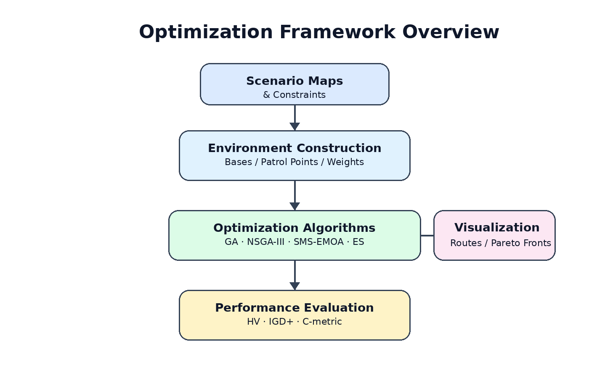
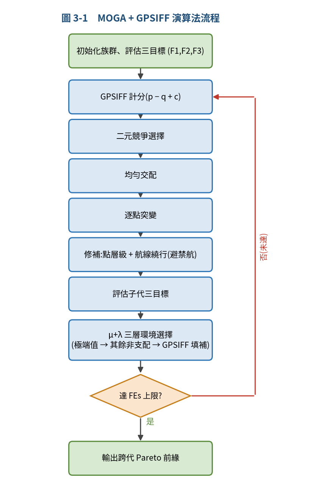
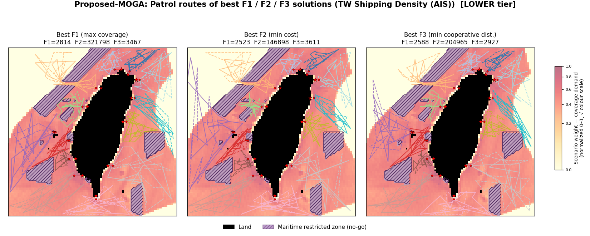
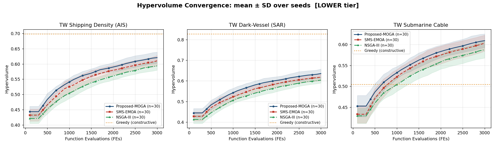
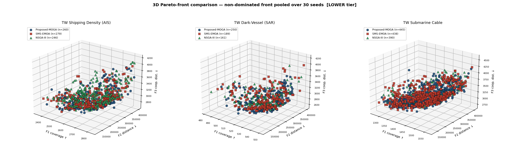
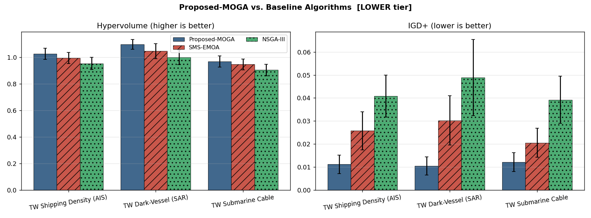

<p align="center">
  
</p>

# Multi-Objective Optimization Framework

A **reusable Python framework** for solving **multi-objective optimization** problems using evolutionary algorithms.

The repository demonstrates the framework through a **cooperative maritime patrol planning** case study involving UAVs, USVs, and patrol vessels. The framework is designed to be modular and reusable for other optimization problems.

<p align="center">


</p>

---

## Project Highlights

| Feature | Description |
|----------|-------------|
| Optimization Framework | Modular evolutionary optimization workflow |
| Algorithms | GA, NSGA-III, SMS-EMOA, Evolutionary Strategy |
| Evaluation | Hypervolume (HV), IGD+, C-metric |
| Visualization | Patrol routes, Pareto fronts, convergence analysis |
| Case Study | Cooperative maritime patrol planning |

---

## Framework Overview

<p align="center">

</p>

The framework contains four major stages:

1. Environment Construction
2. Evolutionary Optimization
3. Performance Evaluation
4. Visualization

---

## Repository Structure

```text
.
├── src/
├── data/
├── figures/
├── assets/
├── public_notes/
├── README.md
├── requirements.txt
└── LICENSE
```

---

## Implemented Algorithms

| Algorithm | Description |
|-----------|-------------|
| GA | Genetic Algorithm |
| NSGA-III | Many-objective evolutionary optimization |
| SMS-EMOA | Hypervolume-based optimization |
| ES | Evolutionary Strategy |

---

# Representative Experimental Results

## Optimization Workflow

<p align="center">

</p>

## Representative Patrol Routes

<p align="center">

</p>

The figure above presents representative Pareto-optimal patrol routes optimized for different objectives.

---

## Hypervolume Convergence

<p align="center">

</p>

The convergence curves compare optimization performance across evolutionary algorithms over multiple independent runs.

---

## Pareto Front

<p align="center">

</p>

The union Pareto front illustrates the trade-offs among multiple objectives.

---

## Performance Summary

<p align="center">

</p>

The framework evaluates solution quality using:

- Hypervolume (HV)
- IGD+
- C-metric

---

## Quick Start

```bash
pip install -r requirements.txt
python src/experiment.py
```

---

## Research Background

This project originates from a master's research on cooperative maritime patrol planning using evolutionary multi-objective optimization.

Rather than presenting only a thesis implementation, this repository focuses on the optimization framework itself and demonstrates its application through a real-world case study.

---

## Future Work

- Additional optimization algorithms
- Benchmark optimization problems
- Improved visualization modules
- Unit tests and CI/CD
- General optimization interfaces

---

## License

Released under the MIT License.
