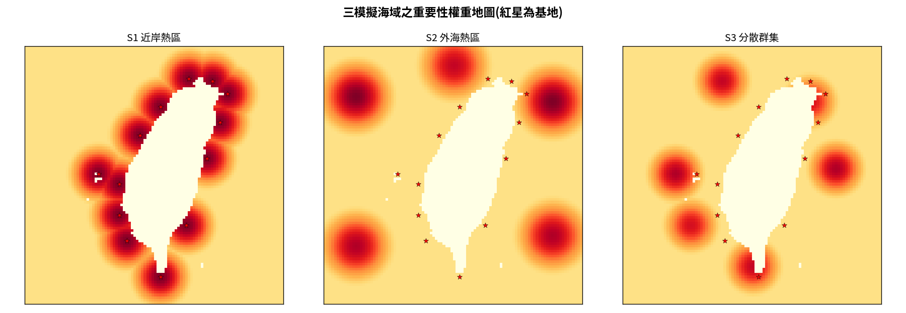
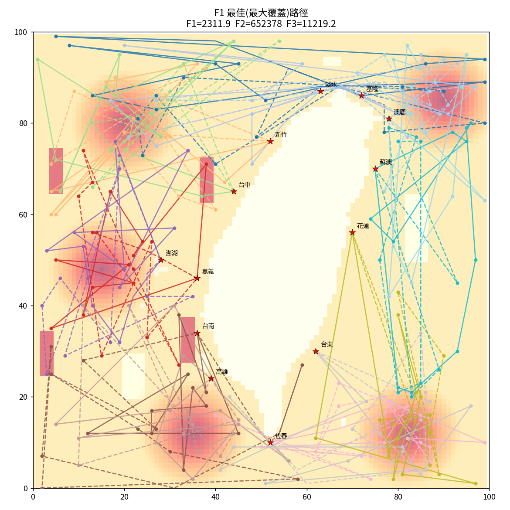
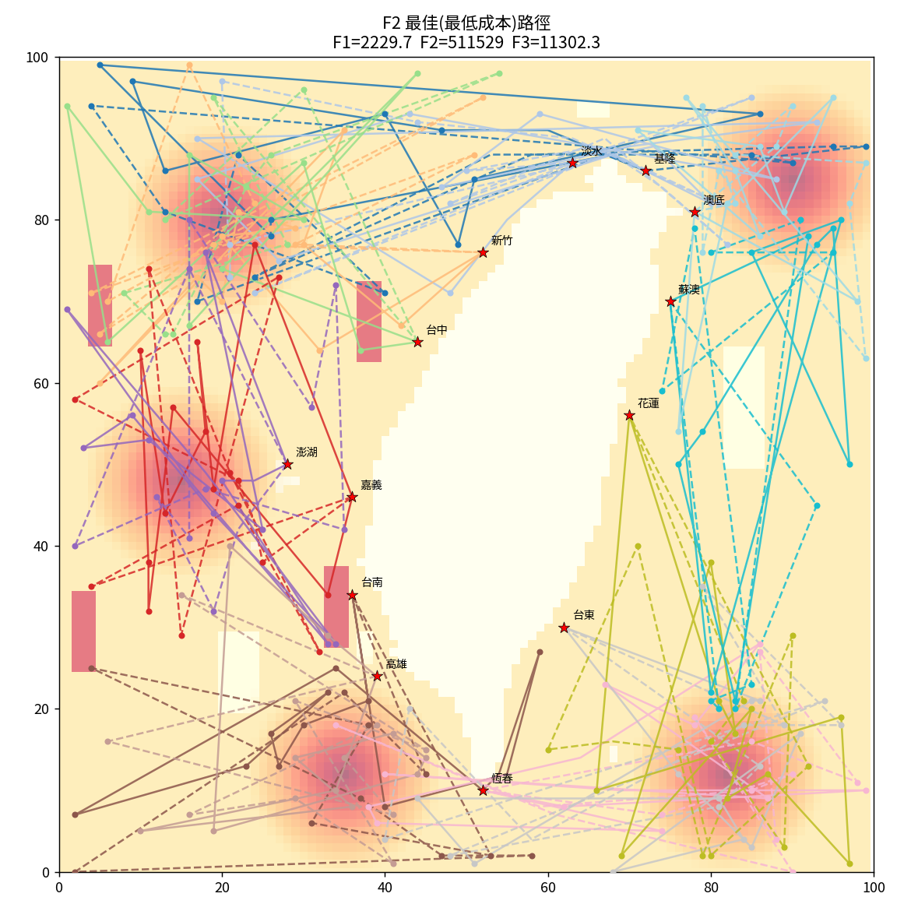
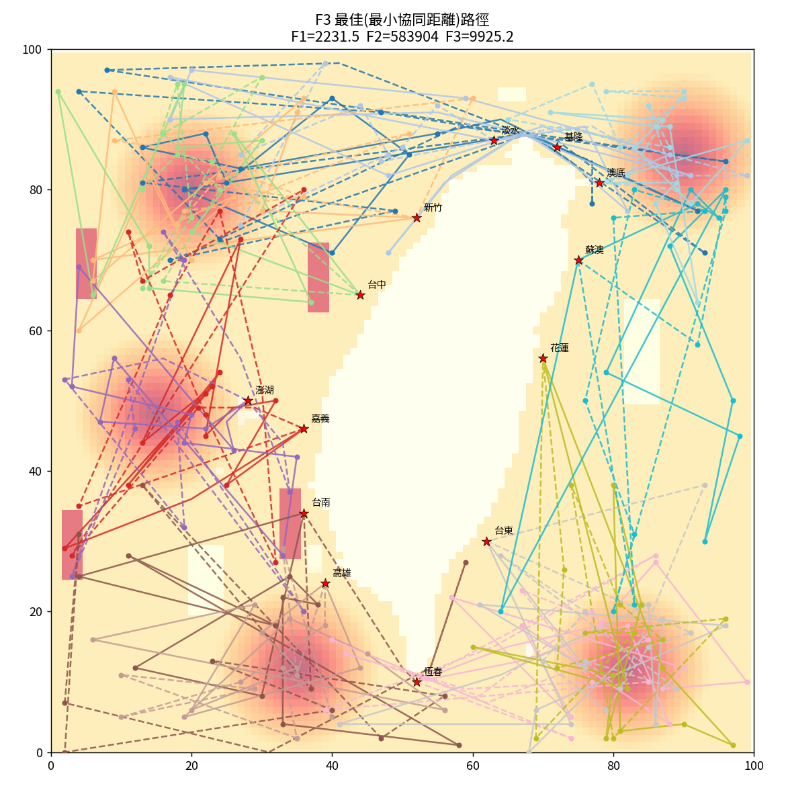
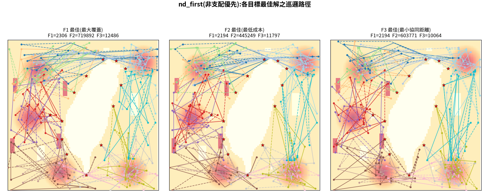
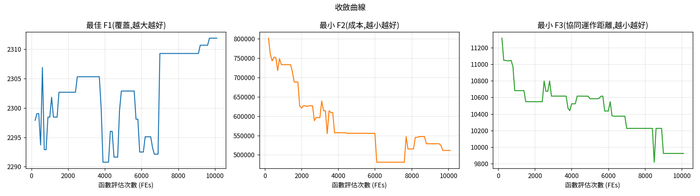
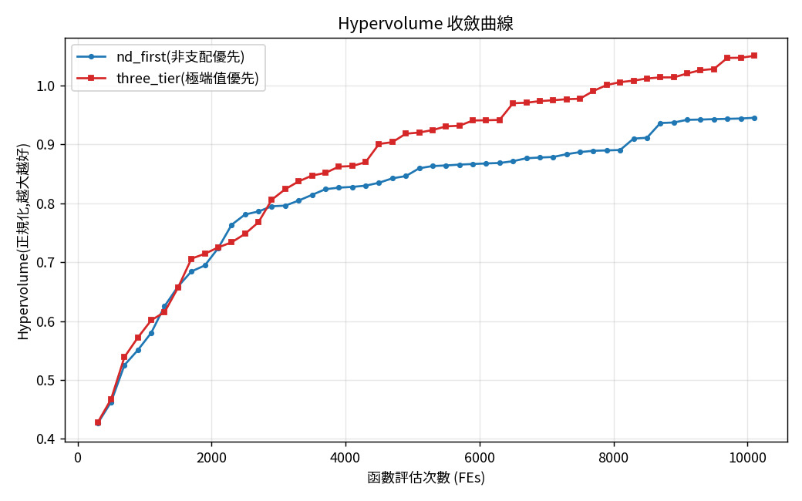

# Python Multi-Objective Optimization Framework

A Python framework for solving **multi-objective optimization** problems
using evolutionary algorithms.

This project demonstrates a **cooperative maritime patrol planning**
problem involving UAVs, USVs, and patrol vessels. The framework supports
multiple optimization algorithms, automated experiment management,
performance evaluation, and visualization of Pareto-optimal solutions.

> **Note:** This repository is a portfolio version prepared for software
> engineering and algorithm development demonstration.

------------------------------------------------------------------------

## Project Highlights

-   Multi-objective Optimization Framework
-   Genetic Algorithm (GA)
-   NSGA-III
-   SMS-EMOA
-   Evolutionary Strategy (ES)
-   Cooperative Maritime Patrol Planning
-   Automated Experiment Management
-   Hypervolume (HV), IGD+, and C-metric Evaluation
-   Visualization of Pareto-optimal Solutions

------------------------------------------------------------------------

# Framework

> Replace the following placeholder with:

`figures/flowchart.png`

``` text
Environment
      │
      ▼
Optimization Algorithms
      │
      ▼
Performance Evaluation
      │
      ▼
Visualization
```

------------------------------------------------------------------------

# Repository Structure

``` text
.
├── src/                  Core source code
├── data/                 Example maps and scenario data
├── figures/              Figures used in README
├── public_notes/         Public notes
├── README.md
├── requirements.txt
└── LICENSE
```

------------------------------------------------------------------------

# Implemented Algorithms

-   Genetic Algorithm (GA)
-   NSGA-III
-   SMS-EMOA
-   Evolutionary Strategy (ES)

All algorithms are evaluated under identical experimental settings to
ensure fair comparison.

------------------------------------------------------------------------

# Example Results

Please place the following images in this order.

1.  `figures/scenarios_preview.png`
2.  `figures/pareto_front.png`
3.  `figures/path_bestF1.png`
4.  `figures/path_bestF2.png`
5.  `figures/path_bestF3.png`
6.  `figures/path_nd.png`
7.  `figures/convergence.png`
8.  `figures/cmp_hv_curve.png`

Example markdown:

``` md














```

------------------------------------------------------------------------

# Performance Evaluation

The framework provides built-in evaluation using:

-   Hypervolume (HV)
-   IGD+
-   C-metric

These indicators are used to compare the quality of Pareto fronts
produced by different optimization algorithms.

------------------------------------------------------------------------

# Quick Start

``` bash
pip install -r requirements.txt
python src/experiment.py
```

------------------------------------------------------------------------

# Research Background

This framework was developed for a master's research project on
**multi-objective cooperative maritime patrol planning**.

The objective is to optimize patrol coverage, operational cost, and
cooperative efficiency using evolutionary multi-objective optimization
algorithms.

------------------------------------------------------------------------

# Future Work

-   Support additional evolutionary algorithms
-   Improve experiment automation
-   Extend benchmark scenarios
-   Enhance visualization modules

------------------------------------------------------------------------

# License

Released under the MIT License.
